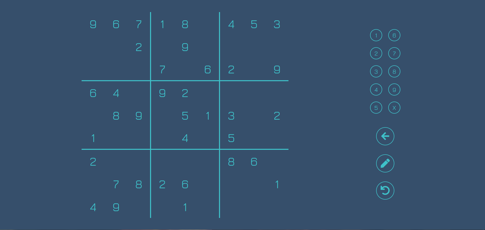

# Sudo-ku

## Summary
A sudoku game project. Recursively creates game board, and allow players to redo recent actions.

## Live Demo
Link: https://sudo-ku.yuncyang.com/

## Current Feature List
- General
  - Use ReactJs as the main framework.
  - Use React Router for the navigation between different components.
  - Use Jest for unit testing.
- Menu
  - Modified radio button input as carousel to select difficulty.
  - User can start a new game or resume previous played game.
  - User can have multiple games running at the same time, providing they are at different difficulties.
- Game
  - Randomly generate puzzle and solution base on difficulty.
  - Game will check each number on the tile according to basic sudoku rules.
  - User can add number to empty tile using number buttons on the panel.
  - Pressing number button first then tile, or tile first then number button, will have different interactions.
  - User can take notes on the tile.
  - User can redo or return to previous states.

## Technologies Used
- ReactJs
- NodeJs
- React Router
- Jest
- Webpack
- Babel
- Sass
- HTML5
- CSS3
- AWS EC2

## Preview



## Planned Features
- Adding stats for user to see.
- Adding different variations of sudoku.
- Add timer.

## Development
### System Requirement
- NodeJs 10 or higher
- NPM 6 or higher
- PostgreSQL 10 or higher

### Getting Started
1. Clone the repository
  ```
  git clone https://github.com/YunCYang/sudo-ku
  cd sudo-ku
  ```
2. Install all dependencies with NPM
  ```
  npm install
  ```
3. Start the project. You can view the running application by opening http://localhost:3000 in your browser.
  ```
  npm run build
  ```
